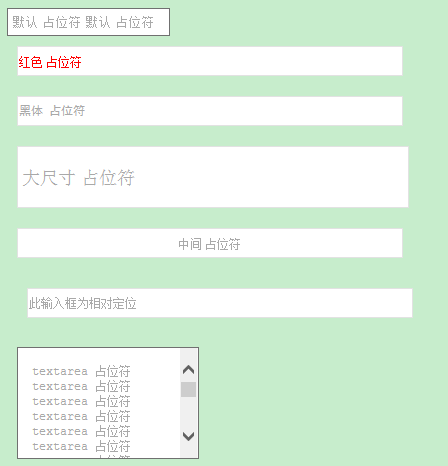

placeholder
=======

为了解决IE9-等浏览器不支持placeholder属性的组件，不依赖于任何框架，符合AMD标准

### 使用方法

    require(
        ['placeholder'],
        function(placeholder) {
            // 渲染页面中所有的定义了placeholder属性的input和textarea控件
            placeholder.init();

            // 渲染某些指定的元素
            placeholder.init(document.getElementsByTagName('textarea'));
        }
    );

### 示例

